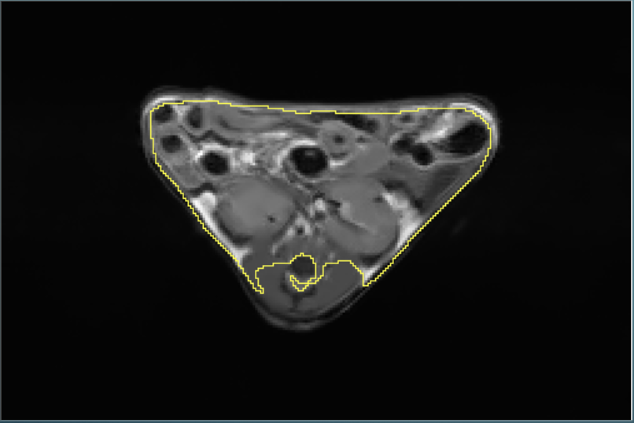

# MRIproject
Code samples from my work with Unet as implemented by ANTsPyNet to segment the abdominal cavity in MRI mouse images

This project took fat suppressed, water suppressed, and non-suppressed data from Bruker 7T MRI machine. Data was then filtered using a non-local mean filter and then cropped to proper size. 

Training data was taken from manual segmentations made using ImageJ. 

Unet taken from ANTsPyNet library and code was adapted from scripts used in other projects

The following examples are outputs from the trained network on images not seen during training.

